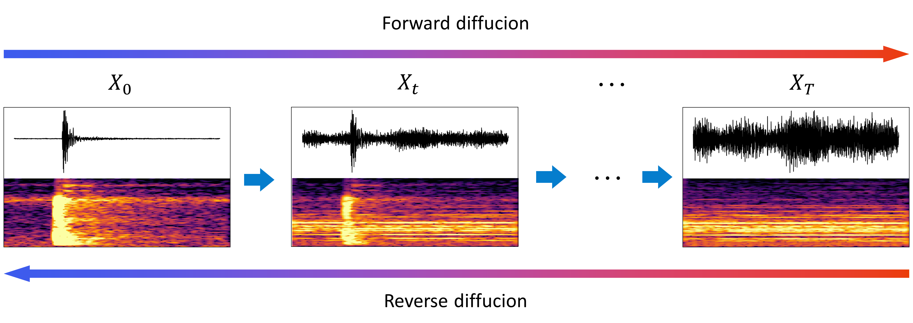

# MircDenoiseEval: A Comprehensive Benchmark for Microseismic Signal Denoising Methods

[](LICENSE) [](https://www.python.org/)

A comprehensive evaluation framework for comparing various microseismic signal denoising methods, including traditional signal processing techniques and state-of-the-art deep learning approaches.

## Graphical Abstract



---

## Installation

### Prerequisites

- Python 3.8 or higher
- CUDA-compatible GPU (recommended for deep learning methods)

### Setup

1. Clone the repository with submodules:

```bash
git clone --recursive https://github.com/yourusername/MircDenoiseEval.git
cd MircDenoiseEval
```

2. Install dependencies:

```bash
pip install -r requirements.txt
```

3. For deep learning methods, ensure you have the appropriate frameworks installed:

```bash
# For TensorFlow-based methods (DeepDenoise)
pip install tensorflow

# For PyTorch-based methods (TSTNN, AE)
pip install torch torchvision torchaudio
```

---

## Methods Overview

This repository includes implementations and evaluations of six denoising methods:

### Traditional Signal Processing Methods

| Method   | Description                                                                                                                                                                                  |
| -------- | -------------------------------------------------------------------------------------------------------------------------------------------------------------------------------------------- |
| **WT**   | Wavelet-based denoising using multi-level decomposition with adaptive thresholding. Supports hard, soft, and semi-soft thresholding strategies based on median absolute deviation (MAD).     |
| **VMD**  | Decomposes signals into intrinsic mode functions (IMFs) with adaptive bandwidth. Based on the algorithm by Dragomiretskiy & Zosso (IEEE Trans. Signal Processing, 2014).                     |
| **EMD**  | Data-driven decomposition method that separates signals into IMFs based on local oscillation characteristics. Includes automatic noise mode selection based on energy distribution.          |
| **EEMD** | Ensemble Empirical Mode Decomposition that improves EMD by adding white noise to reduce mode mixing. Supports configurable noise width, ensemble trials, and multiple IMF selection methods. |

### Deep Learning Methods

| Method          | Description                                                                                                                                                                                                                                                                                               |
| --------------- | --------------------------------------------------------------------------------------------------------------------------------------------------------------------------------------------------------------------------------------------------------------------------------------------------------- |
| **DeepDenoise** | Deep neural network for seismic signal denoising and decomposition. Pre-trained model available. Reference: Zhu et al., "Seismic Signal Denoising and Decomposition Using Deep Neural Networks".                                                                                                          |
| **TSTNN**       | Two-Stage Transformer based Neural Network for signal enhancement in time domain. Originally proposed for speech enhancement (ICASSP 2021). Features dual-transformer architecture with dense blocks.                                                                                                     |
| **AE**          | Convolutional autoencoder with multi-head 1D convolutions for microseismic signal denoising. Includes custom signal loss function combining MSE and correlation coefficient.                                                                                                                              |
| **DMSD**        | A denoiser specifically designed for microseismic signals, based on a dual-conditional diffusion framework and pre-trained on large-scale noise datasets. This technology is protected by patent application. For further information or commercial cooperation, please contact: tang_shibin@dlut.edu.cn. |

## Example Denoising Results (DMSD)


---
---

## Usage

Each denoising method provides a command-line evaluation script. Use `-h` to view all available options for any script.

### Wavelet Transform (WT)

```bash
# View all options
python WT/wt_eval.py -h

# Basic usage
python WT/wt_eval.py \
    --noisy_file data/noisy_signals.csv \
    --clean_file data/clean_signals.csv \
    --output_dir WT/results \
    --wavelet sym8 \
    --level 8 \
    --threshold_type 2 \
    --plot_samples 5
```

### Variational Mode Decomposition (VMD)

```bash
# View all options
python VMD/vmd_eval.py -h

# Basic usage
python VMD/vmd_eval.py \
    --noisy_file data/noisy_signals.csv \
    --clean_file data/clean_signals.csv \
    --output_dir VMD/results \
    --alpha 2000 \
    --K 5 \
    --noise_modes auto \
    --mode_selection correlation \
    --num_signals 256 \
    --plot_samples 5
```

### Empirical Mode Decomposition (EMD/EEMD)

```bash
# View all options
python EMD/emd_eval.py -h

# EMD basic usage
python EMD/emd_eval.py \
    --noisy_file data/noisy_signals.csv \
    --clean_file data/clean_signals.csv \
    --output_dir EMD/results \
    --method emd \ (EMD or EEMD)
    --imf_threshold 0.2 \
    --noise_modes 1 \
    --num_signals 256 \
    --plot_samples 5

# EEMD usage
python EMD/emd_eval.py \
    --method eemd \
    --noise_width 0.01 \
    --trials 20 \
    --selection_method correlation \
    --noisy_file data/noisy_signals.csv \
    --clean_file data/clean_signals.csv
```

### Autoencoder (AE)

```bash
# View all options for evaluation
python AE/evaluate.py -h

# Evaluation usage
python AE/evaluate.py \
    --model_path AE/models/conv_autoencoder.pt \
    --noisy_file data/noisy_signals.csv \
    --clean_file data/clean_signals.csv \
    --output_dir AE/results \
    --batch_size 256 \
    --max_plots 5

# Training usage (view options with -h)
python AE/train.py -h

python AE/train.py \
    --data_dir ./data \
    --epochs 50 \
    --batch_size 64 \
    --signal_loss
```

---


### Related Publications

- DeepDenoise: Zhu, W., Mousavi, S. M., & Beroza, G. C. (2018). Seismic Signal Denoising and Decomposition Using Deep Neural Networks. arXiv:1811.02695.
- TSTNN: Wang, K., He, B., & Zhu, W. P. (2021). TSTNN: Two-Stage Transformer based Neural Network for Speech Enhancement in Time Domain. ICASSP 2021.
- VMD: Dragomiretskiy, K., & Zosso, D. (2014). Variational Mode Decomposition. IEEE Trans. on Signal Processing, 62(3), 531-544.

---

## License

This project is licensed under the MIT License - see the [LICENSE](LICENSE) file for details.

---

## Acknowledgments

- [DeepDenoiser](https://github.com/AI4EPS/DeepDenoiser)
- [TSTNN](https://github.com/key2miao/TSTNN)
- [PyEMD](https://github.com/laszukdawid/PyEMD) for EMD implementation
- [PyWavelets](https://github.com/PyWavelets/pywt) for wavelet transform

